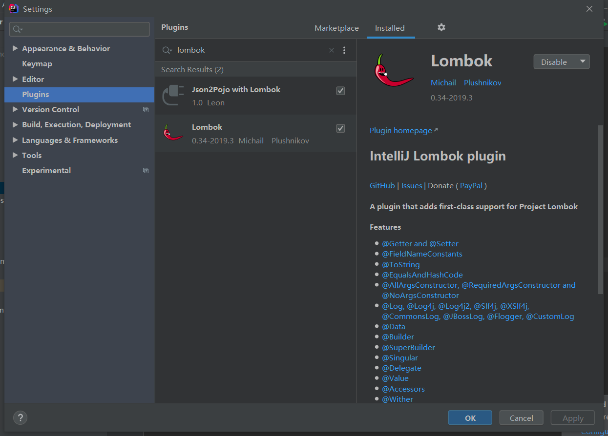
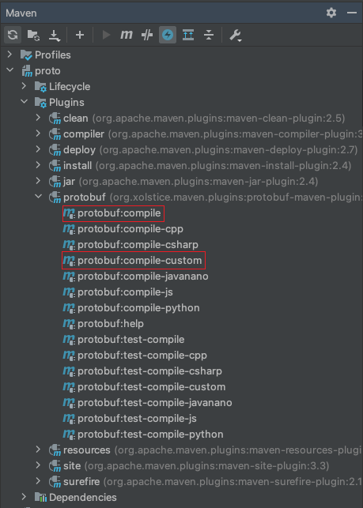

## IDEA配置
### lombok
由于VtDriver源码使用了lombok插件提供的一些注解，需要在IDEA中安装
file-->setting-->plugins，输入 Lombok 搜索，进行安装

### proto编译
VtDriver内部使用了一些proto生成的代码，已经把需要用到的类利用protobuf生成后放入VtDriver的目录下
若需要修改proto文件，可按照下面的步骤生成proto对应的java类，并放入源码中
