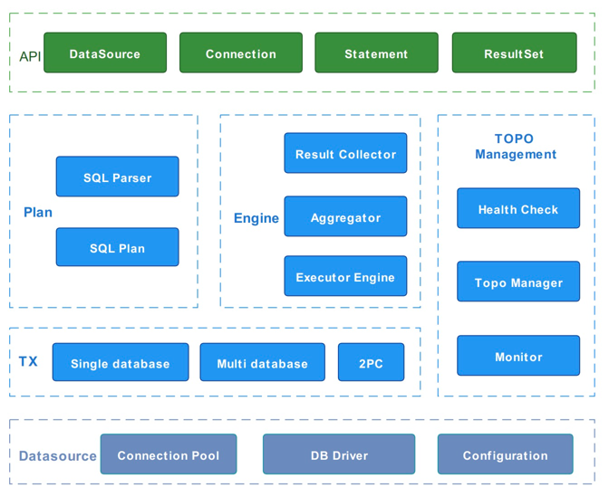

# VtDriver

[中文文档](./../README.md)

VtDriver is a Java database client solution of the distributed databases based on the Vitess. It provides Vitess-related
services, such as distributed databases querying, read-write split, health check, and flexible scaling at the Java JDBC
layer. The VtDriver allows the Java application to access data nodes directly by operating standard JDBC interface
rather than visiting agent nodes (VtGate). As the VtDriver follows the standard of JDBC API, it can be treated as a JDBC
driver of the Vitess database, and supports the most of popular database middlewares such as Druid, Hikari and MyBatis.

## Content Table

* [Why VtDriver](#Why_VtDriver)
* [Architecture](#Architecture)
* [Road Map](#Road_Map)
* [Acknowledgements](#Acknowledgements)

## 
Why VtDriver

The VtDriver is a supplement for the Vitess ecosystem. It aims to shorten data access paths, improve database
performance, and save computing resources. This can benefit OLTP Java Apps which require high performance and users
whose CPU is relatively more expensive than other resources.

As a distributed database architecture, the Vitess deploys some agent modules between clients and database nodes to
support functions, such as multi-language accessibility, shards management, and data synchronization. This design
enables the distributed database system to have high availability, flexibility, and scalability. As the left picture
shows, a data request coming from the app side has to go through the path of VtGate->VtTablet->Database in the Vitess
architecture.

Compared with the traditional Vitess architecture, the VtDriver solution integrates the most of functionalities of
VTGate and VTTalet to a jar package so that the application is able to send the data request to the Data node directly.
This method can optimize the latency because some network communication overhead is removed. Additionally, as this
solution also decreases the dependency on agent modules, it can save resource costs from maintaining VTGate and VTTablet
clusters.

It should be noted that VtDriver is a supplement to the Vitess ecosystem rather than an alternative. VtDriver still
needs to interact with VTTablet and Topo metadata to support functionalities such as health check, automatic failover,
and horizontal scaling. Therefore, it is necessary to build a complete Vitess environment first. In addition, users also
need to pay attention to the number of the database connection, because the database is connected directly from the app
side and skips the protection from the agent module. The following diagram is a comparison of some characteristics
between the traditional Vitess solution and the VtDriver solution:

|                          | **Vitess-VtGate** | Vitess-VtDriver |
| :----------------------- | ----------------- | --------------- |
| **Connection Cost**      | Low               | High            |
| **Programming Language** | Any language      | Only Java       |
| **Performance**          | Middle            | High            |
| **Terminal Entry**       | Yes               | No              |

## 
Architecture

The VtDriver is designed as a Java Database Driver which provides distributed databases accessibility, high availability
and scalability. It is composed of API modules, Plan Modules, Engine Modules, TX modules, Datasource Modules and Topo
Management Modules.

* __API__: This module is the entrance of the Java application. It implements the standard JDBC Interface so that the
  application only needs to replace JDBC-driver to access the vitess database.
* __Plan__: The plan module is responsible for producing logic execution plan based on SQL request and Topo metadata.
* **Engine**: The engine module is responsible for executing plan produced by plan module, collecting and processing the
  result from data nodes, and return the final result to the application program.
* **TX**: The TX module manages the database transaction, including single database and multi database. The 2PC model is
  developing.
* **Datasource**: This module manages connections with all data nodes, including connection pool, JDBC driver and
  configuration.
* **TOPO Management**: The topology management module is responsible for reading topology information and metadata from
  Vitess, including database top, table schema, tablet status.

## 
Road Map

### Database

* Vitess based on MySQL

### VIndex

* only support murmurHash

### DML/DDL

* Select/Insert/Update/Delete

### SQL

* AGGREGATION
* DISTINCT
* HAVING
* ORDER BY
* GROUP BY
* JOIN
* UNION/UNION ALL
* SUBQUERY /PULLOUT SUBQUERY

### Query Method

* Simple Query
* Stream Query
* MultiQuery

### Auto Increment Key

* Sequence

### Distributed Transactions

* Best-effort distributed transactions
* Does not support two-phase commit

## 
Acknowledgements

VtDriver references many solution and suggestions from opensource projects. Sincere thanks to these projects and
contributors. Because of them, we can stand on the shoulders of giants to look at the world.

* [Vitess](https://vitess.io/)
* [Druid](https://github.com/alibaba/druid)
* [mysql-connector](https://github.com/mysql/mysql-connector-j)
* [prometheus](https://prometheus.io/)

* [HikariCp](https://github.com/brettwooldridge/HikariCP)
* [ShardingSphsere](https://shardingsphere.apache.org/)

**Note: Especially thanks Vitess, as it help us to save a lot of R&D costs. Thanks PlanetScale CTO Sugu Sougoumarane
(link : https://github.com/sougou ) support our team**